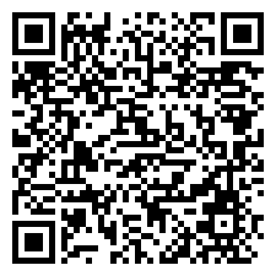

# 旅安 TravelSafe — 安装包发布页

给中国自由行游客的「出境应急大脑」：出发前给你一页纸，在现场给你一张卡，没网也能用。

> 本仓库仅发布安装包（APK），源代码在私有仓库维护。

## 扫码下载（v0.1.0）

用手机浏览器或系统扫码工具扫描，即可直接下载 APK：

- 直链：[TravelSafe-v0.1.0.apk](https://github.com/sjyylml/TravelSafe-release/releases/download/v0.1.0/TravelSafe-v0.1.0.apk)
- 全部版本：[Releases](https://github.com/sjyylml/TravelSafe-release/releases)

## 安装说明

1. 扫码或点直链下载 APK（约 16 MB）
2. 打开下载的文件，系统提示「未知来源」时选择**允许本次安装**
3. 微信内扫码如无法直接下载，请点右上角「···」→ 用浏览器打开

要求：Android 8.0（API 26）及以上。当前为 debug 签名测试版，正式上架前会更换签名。

## 当前版本内容

- v0.1.0：三按钮首页（行前风险包 / 现场救场卡 / 离线SOS包）+ 导航骨架，功能陆续开发中
